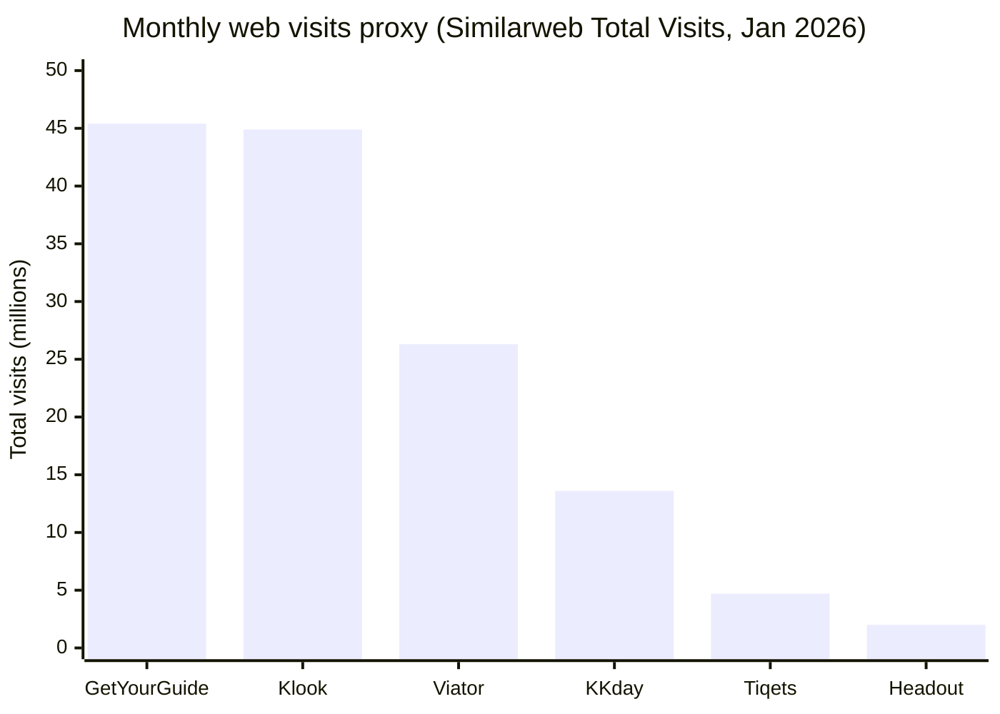

# Tours & Activities OTA Market in 2026

## Executive summary

The global “experiences” sector—tours, activities, attractions and related in-destination products—has moved from an add‑on to a core trip driver, with Arival/Phocuswright research (as previewed by Arival) estimating **$271B in 2025** growing to **$342B by 2029** and projecting continued acceleration in online booking adoption. citeturn15view1 The same research stream also reports that while overall online share of bookings held roughly steady at **~60% (2024→2025)**, **OTA share rose to ~37% of bookings in 2025**, consistent with operators reporting pressure on direct bookings. citeturn15view0turn0search6turn3search4

At the top end, the sector is now anchored by a small set of scaled marketplaces (notably **GetYourGuide**, **Klook**, **Viator**) plus ticketing‑heavy platforms (notably **Tiqets**) and fast-scaling regional champions (e.g., **KKday**, **Civitatis**). Web-traffic proxies from Similarweb (January 2026) show **GetYourGuide (~45.4M visits)** and **Klook (~44.9M)** leading, with **Viator (~26.3M)** and **KKday (~13.6M)** forming the next tier and **Tiqets (~4.7M)** and **Headout (~2.0M)** as significant—but smaller—ticket/attraction-focused players. citeturn6view0turn8view0turn5view0turn10view0turn10view1turn11view0

However, the market’s consumer-facing layer is increasingly **homogenized**: similar homepages (“destination → things to do”), similar product cards (rating, “free cancellation,” “skip-the-line,” “instant confirmation”), similar PDPs (hero imagery, option/variant picker, inclusions/exclusions), and similar checkout constructs (guest checkout, wallet payments, voucher delivery). This UX convergence is tightly linked to inventory overlap: the same high-demand attractions and standardized products are sold across multiple OTAs because (a) suppliers multi-home, (b) resellers syndicate via APIs, and (c) large OTAs must carry “table stakes” inventory to compete in paid search and metasearch. Arival explicitly highlights accelerating online booking, uneven supplier tech adoption, rising OTA channel power, and rapidly evolving AI-driven discovery as structural forces that favor scale—conditions that tend to reinforce sameness. citeturn15view1turn15view0turn13view0
send back
Verdict on the hypothesis (“tours & activities OTAs are monotonous/homogeneous”): **partially validated**. The top-of-funnel, “must-see” inventory and the purchasing UI/checkout mechanics are highly commoditized; meaningful differentiation still exists, but it is **concentrated** in (i) supply exclusivity/quality control, (ii) post‑booking execution and support, (iii) distribution reach (B2B/API), and (iv) content/brand-led demand creation (e.g., social commerce integrations, Originals/curated formats). citeturn15view0turn23view0turn12search1turn24search4turn24search14turn25search6

## Market sizing and channel dynamics

Experiences are increasingly positioned as a primary reason to choose a destination, not a last-minute add-on; Arival’s market-sizing preview highlights a “structural shift” to experiences-first decision making. citeturn15view1 This macro shift is paired with a distribution shift: overall online share appears to be maturing (Arival reports ~60% stable between 2024 and 2025), but the *mix* shifts toward OTAs, rising to ~37% of bookings in 2025. citeturn15view0turn0search6turn3search4

Two additional dynamics shape the OTA competitive set:

First, **platform-wide investment and capital markets pressure** are rising. Arival describes the sector as at an inflection point with investor interest and “major players” expanding. citeturn15view1 Klook’s IPO filing narrative (as summarized by Arival) signals a financialization of the sector: Klook applied to list in the U.S. and disclosed **US$2.3B gross bookings in the nine months through Sept 30** (up 31% vs 2024) and recent profitability. citeturn23view0 GetYourGuide publicly claimed that FY2025 closed with **€4B+ GMV** and **33M+ experiences booked**, alongside profitability and **€1B+ revenue**. citeturn24search4

Second, **connectivity infrastructure** is deepening. GetYourGuide operates an explicit supplier API/Integrator Portal approach and a “connectivity partners” program, indicating an industry move toward standardized inventory/availability feeds. citeturn24search14turn24search21turn24search28turn24search25 TUI Musement’s partner communications emphasize API/white-label distribution and B2B scaling, reinforcing the broader “inventory as a feed” trajectory. citeturn24search26turn24search7turn24search11

## Ranked top sites and platforms

### Ranking criteria used

Because “tours & activities OTA” definitions span pure-play experience marketplaces, attraction-ticketing resellers, and experience divisions inside broader OTAs, there is no single universally reported market-share figure for “T&A OTAs.” This report uses a **hybrid ranking** weighted toward **observable demand and scalable distribution**:

- **Web demand proxy (primary input):** Similarweb “Total Visits” (January 2026) where the domain is clearly experience-focused. citeturn6view0turn8view0turn5view0turn10view0turn10view1turn11view0  
- **Official scale signals (secondary input):** where published, GMV/gross bookings and supply breadth (e.g., GetYourGuide’s public FY2025 statement; Klook IPO filing summary; Tiqets “fast facts”). citeturn24search4turn23view0turn25search28  
- **Distribution footprint (secondary input):** evidence of supplier APIs, affiliate programs, B2B distribution, and multi-channel connectivity. citeturn24search14turn24search28turn25search5turn25search6turn24search11turn13view0  

Where data is missing (especially for app-first players, China-only platforms, or when experiences are a “tab” inside a large accommodation OTA), ranks are **informed estimates** and explicitly labeled in the notes.

### Top 40 OTA tours & activities sites and major regionals

**Note on URLs:** URLs are provided in code formatting to match the request. In many cases, “experiences” is a subpath inside a broader domain.

| Rank | Name | HQ/region | Business model | Unique value prop | Primary product categories | Mobile app (Y/N) | Notes (differences, distribution, UX quick audit, relationships) |
|---:|---|---|---|---|---|:---:|---|
| 1 | entity["company","GetYourGuide","tours marketplace"] | Europe / Global | B2C marketplace + supplier connectivity + affiliate distribution | Large-scale marketplace + “certified”/curated positioning + “Originals”/premium curation | Attractions tickets, guided tours, day trips, passes | Y | Publicly stated FY2025: **€4B+ GMV**, **33M+ experiences booked**, profitability, €1B+ revenue. citeturn24search4 Supplier onboarding emphasizes commission-only model and broad supply scale; provides supplier/provider identification on PDPs. citeturn24search35turn28view2 Has supplier API/integrator docs. citeturn24search14turn24search25turn24search21 URL: `https://www.getyourguide.com/` |
| 2 | entity["company","Klook","apac experiences ota"] | APAC / Global | B2C marketplace; mobile/social-first; deep APAC supply | Discounts + mobile-first discovery; social commerce partnerships | Attraction tickets, tours, transport add-ons, transfers | Y | Similarweb: **44.9M** total visits (Jan 2026). citeturn8view0 IPO filing summary highlights **US$2.3B gross bookings (9M through Sept 30)** and social commerce integrations. citeturn23view0 URL: `https://www.klook.com/` |
| 3 | entity["company","Viator","tripadvisor experiences ota"] | North America / Global | B2C marketplace (Tripadvisor-owned) + affiliate/API distribution | Breadth + review volume; integrated visibility across Tripadvisor surfaces | Tours, day trips, activities, tickets, shore excursions | Y | Similarweb: **26.3M** total visits (Jan 2026). citeturn5view0 (Public financial specifics often sit in Tripadvisor reporting; third-party summaries indicate ongoing growth, but primary filings were partially blocked during this scrape.) citeturn16search27 URL: `https://www.viator.com/` |
| 4 | entity["company","KKday","asia tours marketplace"] | APAC (Taiwan-led) | B2C marketplace, APAC-heavy supply | “All kinds of unique experiences” with strong Asian destination focus | Tickets, tours, transport, transfers | Y | Similarweb: **13.6M** total visits (Jan 2026). citeturn10view0 URL: `https://www.kkday.com/` |
| 5 | entity["company","Tiqets","mobile attraction tickets"] | Europe / Global | Ticketing-first reseller + venue partnerships + distributor API | Mobile tickets + “skip-the-line” positioning; culture/attraction focus | Museums, attractions, passes, some tours | Y | Similarweb: **4.7M** total visits (Jan 2026). citeturn10view1 “Fast facts” claims **50M+ customers**, **4K+ venue partners**, **3.9M+ app downloads**. citeturn25search28 Distributor API docs exist. citeturn25search5turn25search9 URL: `https://www.tiqets.com/` |
| 6 | entity["company","Civitatis","spanish language t&a ota"] | Europe / LatAm-oriented | Marketplace (strong Spanish-speaking demand) + affiliate/API | Spanish-language breadth; also notable for “free tours” affiliate economics | Day trips, city tours, excursions, transfers | Y | Affiliate panel publishes commission bands and indicates payouts post-activity; also offers an API/feed for integration. citeturn25search3turn25search11 URL: `https://www.civitatis.com/` |
| 7 | entity["company","TUI Musement","tui tours activities division"] | Europe / Global | Hybrid: B2C + strong B2B/API & white-label distribution | Integrated TUI supply + B2B distribution tooling | Tours & activities + multi-day itineraries + transfers | Y | Partner comms emphasize **API and white-label distribution**, broad portfolio, and B2B scaling. citeturn24search26turn24search11 Public press note: API integration distributing multi-day tours via TravelExchange. citeturn24search7 URL: `https://www.musement.com/` |
| 8 | entity["company","Headout","attractions tickets marketplace"] | Global (multi-region) | Attraction ticketing + distribution/affiliate/API | Strong emphasis on attraction entry, city tickets; distribution programs | Attraction tickets, city cards, shows | Y | Similarweb: **2.0M** total visits (Jan 2026). citeturn11view0 Affiliate program explicitly offers widgets/links/API. citeturn25search2turn25search6 Help center describes connectivity options incl. channel managers and browser automation. citeturn25search26 URL: `https://www.headout.com/` |
| 9 | entity["company","HelloTickets","tours tickets reseller"] | Europe / Americas | Reseller/OTA (tickets + tours) | Aggressive SEO + attraction-first packaging | Attraction tickets, tours, city experiences | Y | Listed as T&A OTA by Arival. citeturn13view0 URL: `https://www.hellotickets.com/` |
| 10 | entity["company","isango!","hotelbeds experiences brand"] | Europe / Global | OTA/reseller (Hotelbeds-related brand) | Bundled “things to do” with OTA-style merchandising | Tours, activities, tickets | N/Unclear | Listed by Arival as T&A OTA; likely leverages broader Hotelbeds distribution ecosystem. citeturn13view0 URL: `https://www.isango.com/` |
| 11 | entity["company","Airbnb Experiences","airbnb experiences marketplace"] | Global | Marketplace (hosted experiences) within broader platform | “Experiences” reintroduced with redesigned app; emphasis on locals + curated “Originals” | Local activities, tours; also adjacent “Services” | Y | Airbnb’s 2025 summer release explicitly reintroduced Experiences (and Services) with an all-new app. citeturn12search1turn12search3turn12search20 URL: `https://www.airbnb.com/s/experiences` |
| 12 | entity["company","Booking.com","global accommodation ota"] | Global | Broad OTA w/ experiences division | Cross-sell on huge lodging demand; packaged “attractions” | Attractions, tours, transfers | Y | Listed by Arival as an OTA with an experiences division. citeturn14view0 URL: `https://www.booking.com/attractions/` |
| 13 | entity["company","Expedia","global online travel agency"] | Global | Broad OTA w/ experiences division | Cross-sell + loyalty bundling | “Things to do,” tickets, tours | Y | Listed by Arival as an OTA with experiences division; experiences are typically a subpath. citeturn14view0 URL: `https://www.expedia.com/Things-To-Do` |
| 14 | entity["company","Trip.com","trip.com experiences"] | APAC / Global | Broad OTA w/ experiences division | APAC traveler demand; deep China/Asia inventory | Tickets, tours, transport add-ons | Y | Listed by Arival in “OTAs with an experiences division.” citeturn14view0 URL: `https://www.trip.com/things-to-do/` |
| 15 | entity["company","Traveloka","sea travel platform"] | SE Asia | Broad OTA w/ experiences division | “Xperience” vertical in SE Asia | Activities, tickets, local transport | Y | Listed by Arival; experiences often under a dedicated vertical. citeturn14view0 URL: `https://www.traveloka.com/en` |
| 16 | entity["company","Fliggy","alibaba travel platform"] | China | Broad OTA w/ experiences division | China-centric demand; ecosystem distribution | Tickets, tours, transport add-ons | Y | Listed by Arival. citeturn14view0 URL: `https://www.fliggy.com/` |
| 17 | entity["company","MakeMyTrip","india ota"] | India | Broad OTA w/ experiences division | India-scale demand + cross-sell | Activities, tours, tickets | Y | Listed by Arival. citeturn14view0 URL: `https://www.makemytrip.com/` |
| 18 | entity["company","MyRealTrip","korea travel platform"] | Korea | Broad OTA w/ experiences division | Korea-origin outbound/inbound experience demand | Tours, tickets, activities | Y | Listed by Arival; also referenced by Arival as a “major player” eyeing public markets. citeturn14view0turn15view1 URL: `https://www.myrealtrip.com/` |
| 19 | entity["company","Rakuten Travel Experiences","rakuten experiences platform"] | Japan | Experiences vertical | Built into Rakuten ecosystem | Tickets, tours, activities | Y | Listed by Arival as Rakuten experiences URL. citeturn14view0 URL: `https://experiences.travel.rakuten.com/` |
| 20 | entity["company","lastminute.com","europe online travel agency"] | Europe | Broad OTA w/ experiences division | Bundled short-break demand | Tickets, tours, activities | Y | Listed by Arival. citeturn14view0 URL: `https://www.lastminute.com/` |
| 21 | entity["company","Ceetiz","france activities ota"] | Europe | Experiences OTA/reseller | French/European demand; curated activities | Tickets, excursions, tours | N/Unclear | Listed in Arival T&A OTAs. citeturn13view0 URL: `https://www.ceetiz.com/` |
| 22 | entity["company","Evendo","events activities marketplace"] | Europe / Global | Marketplace for events/activities | Group events + activities | Activities, events, experiences | N/Unclear | Listed by Arival. citeturn13view0 URL: `https://evendo.com/` |
| 23 | entity["company","Fever","events discovery platform"] | Global | Events & experiences discovery/checkout | City-based events + “Fever Originals”-style formats | Events, shows, immersive experiences | Y | Listed in Arival T&A OTAs; overlaps with “tickets/events” more than classic sightseeing. citeturn13view0 URL: `https://feverup.com/` |
| 24 | entity["company","Pelago","singapore travel experiences"] | APAC | Experiences marketplace | Singapore/SEA demand; curated travel experiences | Tours, tickets, activities | Y | Listed by Arival as T&A OTA; Similarweb data for the correct domain varied by TLD in this scrape (app-first bias likely). citeturn13view0turn9search2 URL: `https://www.pelago.com/` |
| 25 | entity["company","Project Expedition","global tours marketplace"] | North America | Reseller/marketplace | Broad excursions across destinations | Tours, day trips | N/Unclear | Listed by Arival. citeturn13view0 URL: `https://www.projectexpedition.com/` |
| 26 | entity["company","TourMega","meta tours aggregator"] | Global | Aggregator/metasearch-like | Compares tours/prices across sellers | Tours (comparison) | N | Listed by Arival. citeturn13view0 URL: `https://www.tourmega.com/` |
| 27 | entity["company","Traveloka Xperience","traveloka experiences vertical"] | SE Asia | Experiences vertical | Mobile-led SE Asia experiences | Tickets, tours, activities | Y | Arival lists Traveloka experiences under “axes.traveloka.com”. citeturn14view0 URL: `https://axes.traveloka.com/` |
| 28 | entity["company","Veltra","japan hawaii activities"] | Japan / Global | Regional OTA | Strong Japan outbound + Hawaii/Asia activities | Local tours, activities | Y | Listed as regional OTA by Arival. citeturn14view1 URL: `https://www.veltra.com/` |
| 29 | entity["company","Thrillophilia","india experiences ota"] | India | Regional OTA/marketplace | India-focused experiences SEO + packages | Day trips, activities, packages | Y | Listed as regional OTA by Arival; Similarweb competitor list for Headout includes Thrillophilia, signaling adjacency. citeturn14view1turn11view0 URL: `https://www.thrillophilia.com/` |
| 30 | entity["company","Tripster","russia tours marketplace"] | Eurasia | Marketplace (local guides) | Local-guided experiences; strong regional presence | Tours, excursions | Y | Listed as regional OTA by Arival. citeturn14view1 URL: `https://www.tripster.com/` |
| 31 | entity["company","Withlocals","private local tours"] | Europe / Global | Marketplace (private tours) | Peer-to-peer/private “local host” positioning | Private tours, local experiences | Y | Listed by Arival in “Private Tours & Locals OTAs.” citeturn14view0 URL: `https://www.withlocals.com/` |
| 32 | entity["company","ToursByLocals","private guide marketplace"] | North America / Global | Marketplace (private guides) | Direct-to-guide private tours | Private guided tours | Y | Listed by Arival. citeturn14view0 URL: `https://www.toursbylocals.com/` |
| 33 | entity["company","TakeMeTour","thailand local tours"] | SE Asia | Marketplace (locals/private) | SE Asia local immersion | Day tours, local guides | Y | Listed in Arival “Private Tours & Locals OTAs.” citeturn14view0 URL: `https://www.takemetour.com/` |
| 34 | entity["company","CheckYeti","outdoor activities booking"] | Europe | OTA (adventure/outdoor) | Outdoor/adventure specialization | Ski, outdoor, activities | Y | Listed by Arival as adventure/outdoor OTA. citeturn13view0 URL: `https://www.checkyeti.com/` |
| 35 | entity["company","Manawa","outdoor adventure marketplace"] | Europe / Global | Adventure/outdoor marketplace | “Adventure sports” focus | Outdoor, water sports, adventure | Y | Listed by Arival; also mentioned as an integration target in a distribution fact sheet. citeturn13view0turn3search11 URL: `https://www.manawa.com/` |
| 36 | entity["company","GetMyBoat","boat rental marketplace"] | North America / Global | Vertical marketplace (boats) | Boat rentals/charters as category leader | Boat rentals, charters, water activities | Y | Listed as adventure/outdoor OTA by Arival. citeturn13view0 URL: `https://www.getmyboat.com/` |
| 37 | entity["company","Experience Oz","australia experiences ota"] | Oceania | Regional OTA | Australia/NZ experiences | Activities, attractions, tours | Y | Listed as adventure/outdoor OTA by Arival. citeturn13view0 URL: `https://www.experienceoz.com.au/` |
| 38 | entity["company","BookMe","new zealand deals activities"] | Oceania | Regional OTA/deals | NZ/AU deal-led activities | Tickets, activities, deals | Y | Listed by Arival under Regional OTAs. citeturn14view1 URL: `https://www.bookme.co.nz/` |
| 39 | entity["company","CityPASS","multi-attraction pass"] | North America | Multi-attraction pass publisher | Bundled admission pass | City passes | Y | Listed by Arival under Multi‑Attraction Passes. citeturn14view0 URL: `https://www.citypass.com/` |
| 40 | entity["company","Go City","attraction pass brand"] | Global | Multi-attraction pass publisher (B2C + distributor) | “One pass” value proposition; widely distributed | City passes | Y | Go City publicly publishes pricing and “how it works” mechanics; widely resold across OTAs in this report’s duplication examples. citeturn26search3turn26search14turn27view2turn28view2 URL: `https://gocity.com/` |

**Important scope note:** Arival’s OTA directory lists **150+** digital distributors and OTAs across many “experience-adjacent” categories (events, gifting, passes, etc.). citeturn13view0 The “Top 40” above is therefore a *market-structure* shortlist designed to cover major global scale plus key regional leaders; it is not equivalent to “the only meaningful sellers.”

## Traffic share and scale chart

The following traffic chart uses **Similarweb Total Visits (January 2026)** for a set of experience-focused domains. This is a **web-only** proxy and will understate app-heavy usage in some markets. citeturn6view0turn8view0turn5view0turn10view0turn10view1turn11view0



## UX/UI audit and observed convergence

The UX patterns across leading tours & activities OTAs are converging around an “ecommerce-like” experience with a highly standardized structure. Top platforms now resemble each other in four ways: (1) discovery/navigation, (2) product structure (PDP), (3) checkout and voucher delivery, and (4) post‑purchase support.

As an illustration, the **New York Explorer Pass** listing on GetYourGuide follows a widely replicated PDP template: large image gallery, star rating count, “valid X days,” and a structured sectioning of highlights and full description, with a prominent “Select participants/date/language” flow and explicit provider identification (“Activity provider”). citeturn27view0turn28view2 Tiqets’ listing for the same pass likewise uses a standardized structure (“What’s included,” “Description,” “Additional info,” provider attribution, and “hand‑picked combinations” bundles), reinforcing how attraction‑led products are merchandised similarly across ticketing-first OTAs. citeturn27view2 Headout uses similar skimming-oriented blocks (“Highlights,” “Inclusions,” categorical breakdown, cancellation policy) and typically links users to supplier instructions and/or external details, again consistent with a common industry design language. citeturn27view3

A particularly important driver of UX sameness is that many OTAs are converging on **the same distribution mechanics**, so the UI must reflect: real-time availability, time slots, multiple ticket types, and strict cancellation rules. Evidence of this industrialization includes:

- GetYourGuide’s Supplier API / Integrator Portal and its explicit “supported systems” approach, indicating standardized connectivity from supplier systems. citeturn24search14turn24search25turn24search21  
- Headout’s published terms describing both “Affiliate Partner Program” and a “Distribution Program” with access via API or portal, plus a support doc describing connectivity options including channel managers and browser automation. citeturn25search6turn25search26  
- Tiqets’ Distributor API documentation and partner program pages explicitly designed for distribution partners. citeturn25search5turn25search9turn25search21  
- Civitatis’ affiliate resources explicitly mentioning an API/feed integration option. citeturn25search11turn25search3  
- TUI Musement’s B2B positioning (API/white label) and explicit API-based integrations into travel agency networks. citeturn24search26turn24search7turn24search11  

image_group{"layout":"carousel","aspect_ratio":"16:9","query":["GetYourGuide product page screenshot tours and activities","Viator product page screenshot attraction ticket","Tiqets product page screenshot mobile tickets","Headout product page screenshot attraction tickets"],"num_per_query":1}

## Product overlap and why duplicates are structurally inevitable

### Estimated overlap rate among major OTAs

A precise overlap rate requires SKU-level crawls and supplier-ID normalization across platforms, which is non-trivial due to (i) dynamic pricing/options by date and group size, (ii) different naming conventions for the same underlying supply, and (iii) a mix of direct supplier contracting and reseller layering. Arival’s own framing underscores that the sector is still “under-digitized” relative to broader travel, but is rapidly digitizing; this combination invites fast syndication of the same inventory as suppliers adopt reservation tech and connectivity expands. citeturn15view1turn15view0

With those constraints, the best-supported statement is a **segmented overlap estimate**:

- **Tier-1 global attractions & standardized products (city passes, HOHO buses, timed-entry museum tickets):** **high overlap (estimated 70–90%)** among top OTAs because these products are “table stakes” and are often distributed by the same supplier brands (e.g., city pass publishers) or via reseller APIs. citeturn26search3turn27view2turn25search5turn25search6turn24search14  
- **Mid-tail experiences (popular day trips, widely operated sightseeing tours):** **moderate overlap (estimated 40–70%)**, often driven by multi-homing suppliers using channel managers and by OTAs recruiting the same “top converting” supply. citeturn25search26turn24search28turn15view0  
- **Long-tail/niche experiences (hyperlocal workshops, micro-events, newly launched products):** **lower overlap (estimated 10–40%)**, where differentiation is still possible via exclusives, creator ecosystems, and brand demand generation. Airbnb’s post‑relaunch narrative is explicitly about building Experiences/Services into a redesigned app and expanding categories, which can expand long-tail supply but also introduces new “adjacent” inventory types. citeturn12search1turn12search3turn12search20  

### Heatmap-style overlap view among a top-10 set

This matrix is a **qualitative heatmap** (H/M/L) reflecting the overlap expectations by product archetype and distribution approach, not a computed Jaccard index. It is grounded in the documented existence of affiliate/API distribution programs and supplier connectivity infrastructure across multiple OTAs. citeturn24search14turn24search28turn25search5turn25search6turn25search11turn15view0

Legend: **H** ≈ 70–90%, **M** ≈ 40–70%, **L** ≈ 10–40% overlap likelihood (for tier‑1 attraction SKUs)

| | GetYourGuide | Klook | Viator | KKday | Tiqets | Headout | Civitatis | TUI Musement | HelloTickets | Airbnb Experiences |
|---|---|---|---|---|---|---|---|---|---|---|
| GetYourGuide | — | M | H | M | H | H | H | H | H | L–M |
| Klook | M | — | M | H | L–M | L–M | L–M | L–M | L–M | L |
| Viator | H | M | — | M | H | H | M–H | M–H | H | L–M |
| KKday | M | H | M | — | L–M | L–M | L | L–M | L | L |
| Tiqets | H | L–M | H | L–M | — | H | H | M–H | H | L |
| Headout | H | L–M | H | L–M | H | — | M–H | M | H | L |
| Civitatis | H | L–M | M–H | L | H | M–H | — | M | M | L |
| TUI Musement | H | L–M | M–H | L–M | M–H | M | M | — | M | L |
| HelloTickets | H | L–M | H | L | H | H | M | M | — | L |
| Airbnb Experiences | L–M | L | L–M | L | L | L | L | L | L | — |

### Causes of duplication

Duplication stems from five mechanisms that reinforce each other:

- **Shared suppliers and “multi-homing”:** large suppliers (e.g., pass brands) sell through many channels, and even smaller suppliers increasingly connect via standardized reservation tech; Arival emphasizes rapid online growth potential as operators modernize systems. citeturn15view1turn15view0  
- **Affiliate and distributor programs as a second layer:** Tiqets, Headout, and GetYourGuide explicitly support distribution/affiliate models and APIs, enabling the same inventory to be embedded or resold in multiple storefronts. citeturn25search5turn25search6turn24search10turn25search11  
- **Reseller layering:** some listings are not supplier-direct but come from intermediary distributors; this can multiply “near-identical” listings. (Headout explicitly documents multiple connectivity modes, including via channel managers and automation.) citeturn25search26  
- **SEO/SEM incentives:** if paid search is a major acquisition channel, platforms must carry the same top attractions to bid on the same keywords; Similarweb channel data for leading sites indicates heavy search traffic reliance. citeturn6view0turn8view0turn5view0  
- **Meta-surface amplification:** large travel platforms (e.g., Tripadvisor surfaces bookable products and reviews) can replicate inventory across multiple branded pages, increasing perceived duplication. citeturn26search9  

### Examples of identical or near-identical listings

These examples focus on **a standardized product type (city pass)** where supplier attribution is often explicit and the underlying product is inherently the same. Pricing remains difficult to normalize across OTAs because many platforms display price only after selecting options; therefore, the table uses **“from” prices where clearly visible** and notes when price is variant-dependent.

| Product archetype | Listing | Supplier attribution | Visible “from” price (as captured) | Notes on “identical vs near-identical” |
|---|---|---|---|---|
| City pass | GetYourGuide – NYC Explorer Pass | “Activity provider: Go City - USA” shown on the PDP. citeturn28view2 URL: `https://www.getyourguide.com/en-au/new-york-city-l59/new-york-explorer-pass-top-attractions-including-edge-t5721/` | Price displayed after availability/variant selection (not captured in static scrape). citeturn27view0turn28view2 | **Near-identical** underlying Go City product; OTA-specific merchandising and fulfillment steps (e.g., “Go City via GetYourGuide” emails). citeturn28view2 |
| City pass | Tiqets – Go City New York Explorer Pass | “Provider: GO City USA” + registered address shown. citeturn27view2 URL: `https://www.tiqets.com/en/new-york-attractions-c260932/tickets-for-go-city-new-york-explorer-pass-choose-2-3-4-5-6-or-7-attractions-p974467/` | A “from” price is shown for combinations (example: bundle pricing displays NZ$ amounts in-page). citeturn27view2 | **Near-identical** product with Tiqets-specific bundling (“hand-picked combinations”) on top of the same pass. citeturn27view2 |
| City pass | Headout – Go City New York Explorer Pass | Uses Go City app instructions and categorizes inclusions; “get all details here” points to Go City. citeturn27view3 URL: `https://www.headout.com/city-cards/new-york-explorer-pass-pick-your-attraction-e-10309/` | Price is option-dependent and not visible in captured excerpt. citeturn27view3 | **Near-identical** product; Headout’s UX emphasizes category breakdown and “non-cancellable but valid extended period.” citeturn27view3 |
| City pass | Viator – Go City NYC Explorer Pass | Go City digital pass mechanics described (“one digital pass,” Go City app). citeturn27view1 URL: `https://www.viator.com/en-AU/tours/New-York-City/New-York-City-Explorer-Pass/d687-3958EXPNYC` | Viator commonly displays “From” pricing in listing contexts, but the PDP price was not visible in captured excerpt. citeturn27view1 | **Near-identical** pass product; Viator adds “Why Travellers Choose This Tour” framing and its own review system. citeturn27view1 |
| City pass | Go City official product page (baseline) | Supplier-direct product. citeturn26search3 URL: `https://gocity.com/en/new-york/passes/explorer` | “Explorer Pass from $89” shown on Go City site (example capture). citeturn26search3 | Serves as **supplier baseline**; OTAs resell or distribute the same underlying pass. citeturn26search3turn27view2turn28view2 |

## Supplier → OTA → consumer distribution paths

The distribution stack is increasingly multi-layered. Based on documented supplier APIs, affiliate programs, and B2B distribution models across leading OTAs, the dominant paths look like this. citeturn24search14turn24search28turn25search5turn25search6turn25search26turn24search11

```mermaid
flowchart TD
  A[Supplier / Operator / Attraction] --> B[Reservation / Inventory System]
  B --> C[Channel manager / Connectivity partner]
  C --> D1[Marketplace OTAs\n(GetYourGuide / Viator / Klook / KKday)]
  C --> D2[Ticketing-first OTAs\n(Tiqets / Headout)]
  C --> D3[B2B Whitelabel / API distributors\n(TUI Musement API, etc.)]

  D1 --> E[Consumer web/app checkout]
  D2 --> E
  D3 --> F[Downstream sellers\n(travel agencies, OTAs, affiliates)]
  F --> E

  E --> G[Voucher / Mobile ticket / Pass delivery]
  G --> H[On-site redemption / tour check-in]
```

## Verdict on homogeneity and differentiation opportunities

### Verdict

The hypothesis that the tours & activities OTA market is **monotonous/homogeneous** is **validated for the mainstream** (tier‑1 attractions and standardized SKUs) and **partially invalidated for the long tail** (where supply uniqueness, brand and community matter).

The strongest evidence supporting “homogeneity” is the combination of:

- **A rising OTA share of bookings** reported by operator surveys and market sizing previews. citeturn15view0turn15view1turn0search6turn3search4  
- **Convergent distribution infrastructure** (supplier APIs, affiliate/distribution programs, connectivity partners) that makes copycat inventory propagation easy. citeturn24search14turn25search5turn25search6turn24search28turn25search11turn25search26  
- **Convergent product merchandising patterns** visible across representative standardized products (pass-type PDPs across GetYourGuide, Tiqets, Headout). citeturn27view0turn27view2turn27view3turn28view2  

The strongest evidence against a blanket “monotony” claim is that leading platforms are working to differentiate by (a) expanding into new product types and experience adjacency (Airbnb Experiences + Services), and (b) investing in social/value-channel innovation (Klook’s social commerce integrations; GetYourGuide’s claimed scale and supply tooling). citeturn12search1turn23view0turn24search4turn24search8

### Six strategic differentiation opportunities for a new entrant

**Exclusive, defensible supply strategy**  
The “must-do” layer is commoditized; differentiation requires exclusives or semi-exclusives (allocation, guaranteed timeslots, limited-capacity experiences). This should be built with supplier tools and connectivity from day one because Arival’s market sizing preview frames online growth as tied to digital adoption and connectivity. citeturn15view1turn15view0turn24search28

**Execution-quality moat**  
Win on reliability, not just listing breadth: real-time operational support, proactive disruption handling, and transparent on-the-ground instructions. The Go City resell example shows how fulfillment complexity (multiple confirmations, app syncing) can create friction that a platform can simplify. citeturn28view2turn27view2

**Variant/option intelligence and “explainers” that reduce confusion**  
Many products differ only in entry conditions (timed entry vs hosted entry vs guided tour). Platforms that clearly explain what “skip the line” actually means will reduce refunds and increase trust; third-party travel guidance emphasizes that “skip-the-line” often means bypassing ticket-purchase lines rather than security. citeturn25search24

**Creator-led demand and social commerce distribution**  
Klook’s strategy (per Arival) shows how social platforms can become distribution rails; a new entrant can design discovery and booking for social-native funnels (UGC, short video itineraries, group buying) rather than retrofitting an SEO-first model. citeturn23view0turn8view0

**B2B2C “embedded experiences”**  
Instead of competing head-to-head on the consumer SERP for “Colosseum tickets,” build distribution via partners: hotels, airlines, corporate travel platforms, and niche creators. The existence of mature distributor APIs (Tiqets) and explicit distribution terms (Headout) suggests that “experiences-as-an-API” is already a norm—new entrants can focus on being the best embedded layer for a targeted vertical (e.g., cruises, meetings/event travel). citeturn25search5turn25search6

**A differentiated product architecture for bundles**  
Most OTAs bundle as a thin upsell (“hand-picked combinations”). Tiqets demonstrates this bundling mechanic explicitly. citeturn27view2 A new entrant can differentiate by building *true itinerary bundles* (time-feasible routing, fixed transport legs, dense “day plans”) rather than simple multi-cart add-ons—especially as AI alters discovery and planning behavior (a risk/shift Arival flags at the operator level). citeturn15view0turn15view1