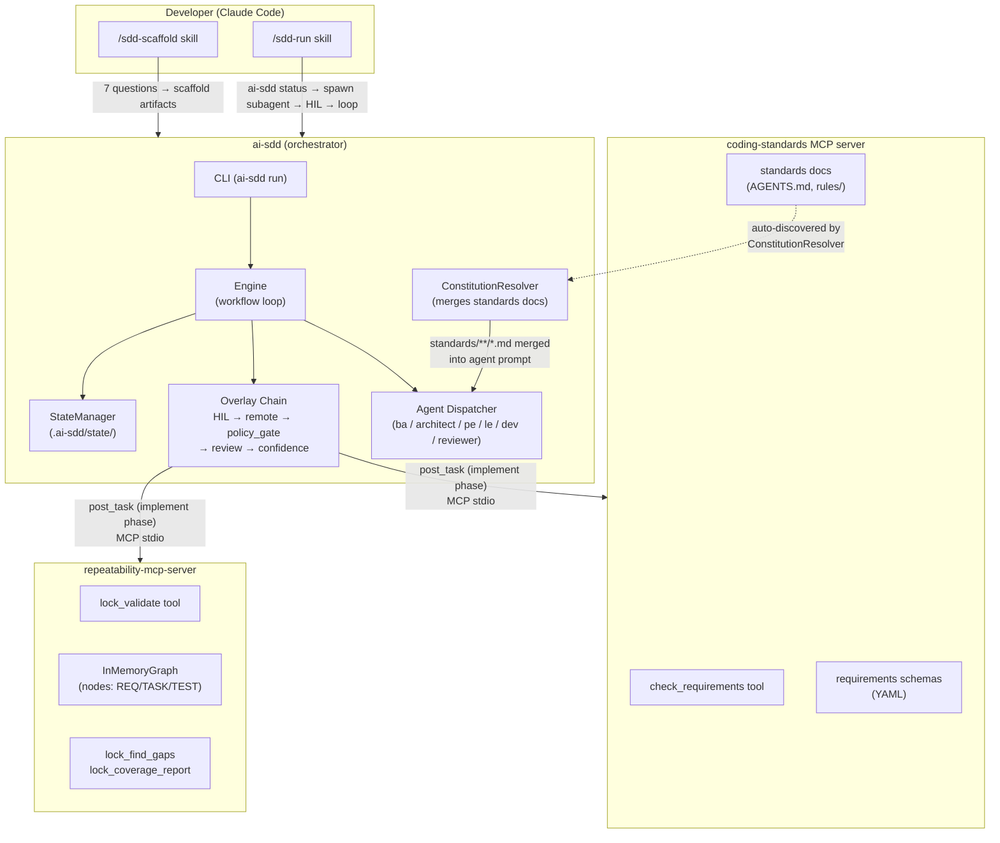
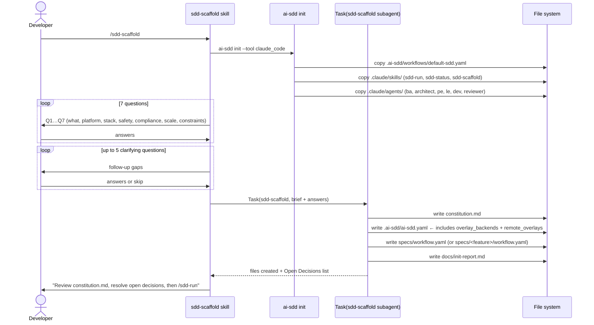
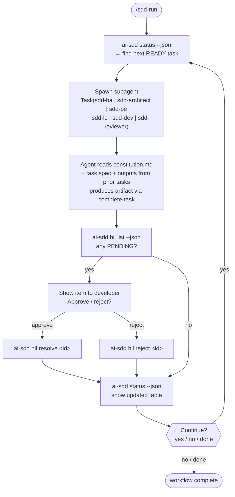
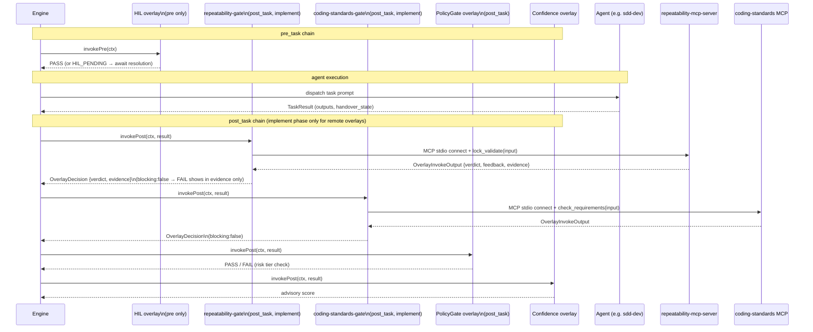
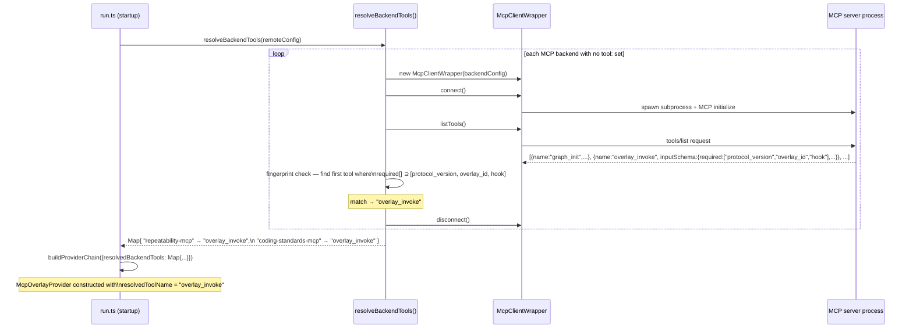
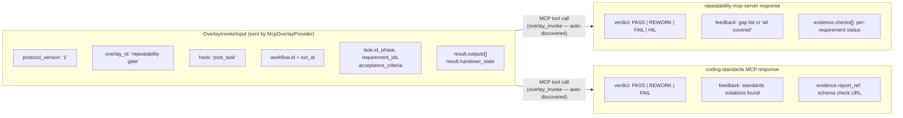
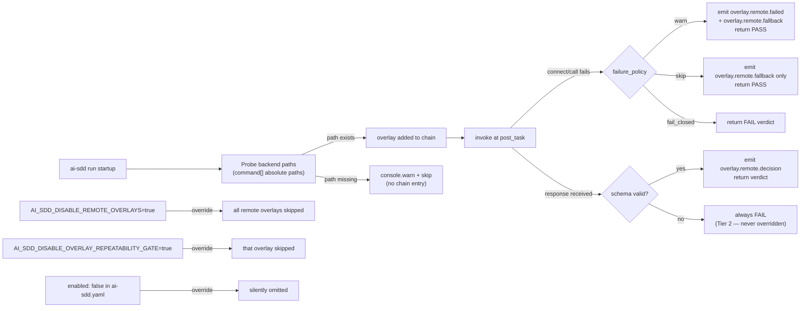
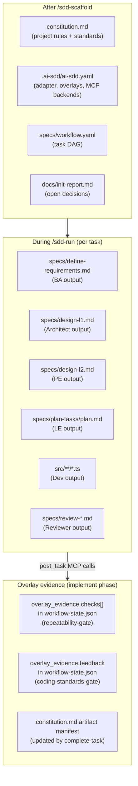

# System Interplay: ai-sdd + coding-standards + repeatability-mcp-server

This document traces exactly what happens when a developer runs `/sdd-scaffold` followed by
`/sdd-run`, showing how the three systems interact throughout.

---

## The Three Systems

| System | Role | Key interface |
|--------|------|---------------|
| **ai-sdd** | Orchestrator — runs the workflow, manages state, dispatches agents, invokes overlays | CLI (`ai-sdd run`), engine, overlay chain |
| **coding-standards** | Standards library + MCP server — exposes schemas and `check_requirements` tool | MCP stdio transport (`coding-standards-gate` overlay) |
| **repeatability-mcp-server** | Requirement lock graph + validation — `lock_validate`, gap detection, coverage | MCP stdio transport (`repeatability-gate` overlay) |

---

## 1. High-Level Architecture

---

## 2. /sdd-scaffold Flow

**What gets wired in during scaffold:**
- `ai-sdd.yaml` is written with `overlay_backends` for both MCP servers and `remote_overlays`
  entries for `repeatability-gate` and `coding-standards-gate` (post_task on implement, non-blocking)
- `constitution.md` merges any `standards/**/*.md` found in the project — the coding-standards
  docs copied during init are auto-discovered here

---

## 3. /sdd-run: Full Workflow Loop

---

## 4. Engine Overlay Chain (per task)

For every task the engine dispatches, it runs the overlay chain twice:
**pre_task** (before the agent runs) and **post_task** (after the agent produces output).

---

## 5a. Auto-Discovery: How ai-sdd Finds `overlay_invoke`

When `tool:` is absent from an `overlay_backends` entry, ai-sdd runs tool discovery at startup
before building the overlay chain:

The fingerprint (`required[]` ⊇ `[protocol_version, overlay_id, hook]`) is the full contract.
Any MCP server that exposes a tool matching it is automatically registered as a remote overlay
— no explicit `tool:` config needed.

---

## 5. What Each MCP Server Receives and Returns

---

## 6. Failure / Availability Paths

---

## 7. Data Produced by Each System per Workflow Run

---

## Summary: Three-System Contract

| Moment | ai-sdd does | coding-standards does | repeatability-mcp-server does |
|--------|-------------|----------------------|-------------------------------|
| **scaffold** | writes `ai-sdd.yaml` with MCP backend entries | standards docs auto-discovered into `constitution.md` | — |
| **pre_task (any)** | HIL gate fires if T0/T2 or `hil.enabled` | — | — |
| **agent prompt assembly** | `ConstitutionResolver` merges `standards/**/*.md` | rules, schemas embedded in every agent prompt | — |
| **implement (agent runs)** | dispatches `sdd-dev` subagent with full context | standards docs are part of the constitution prompt | — |
| **implement post_task** | probes paths → connects MCP → calls tool → stores evidence | validates outputs against requirements schemas → returns verdict | validates requirement lock coverage → detects gaps → returns verdict |
| **FAIL verdict (blocking:false)** | records evidence in state, task still COMPLETES | — | — |
| **FAIL verdict (blocking:true)** | task → NEEDS_REWORK, agent retried | — | — |
